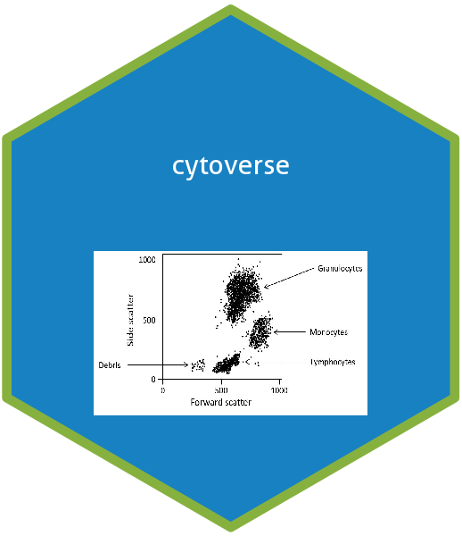

<!-- README.md is generated from README.Rmd. Please edit that file -->

```{r, include = FALSE}
knitr::opts_chunk$set(
  collapse = TRUE,
  comment = "#>",
  fig.path = "README-"
)
```

# cytoverse <a href='https:/cytoverse.org'></a>

## Overview

The cytoverse is a set of packages that are commonly used for cytometry data analysis. The __cytoverse__ package is designed to make it easy to install and load core packages from the cytoverse in a single command.


## Installation

```{r eval = FALSE}
# Install from Bioconductor
BiocManager::install("cytoverse")

# Or the development version from GitHub
# install.packages("devtools")
devtools::install_github("RGLab/cytoverse")
```

## Usage

`library(cytoverse)` will load the core cytoverse packages: 

* [flowWorkspace](http:/github.com/RGLab/flowWorkspace), for gated data interaction.
* [openCyto](http:/github.com/RGLab/openCyto), for auto gating.
* [ggcyto](http:/github.com/RGLab/ggcyto), for data visualisation.
* [CytoML](http:/github.com/RGLab/CytoML), for data analysis import/export through gatingML/xml.


```{r example}
library(cytoverse)
```

